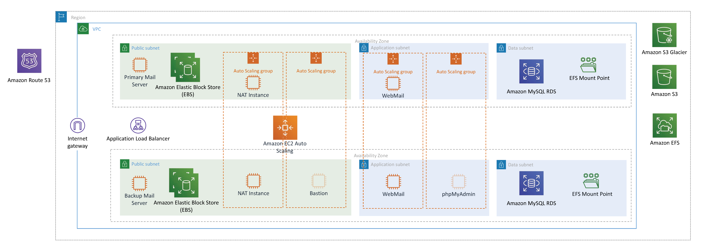
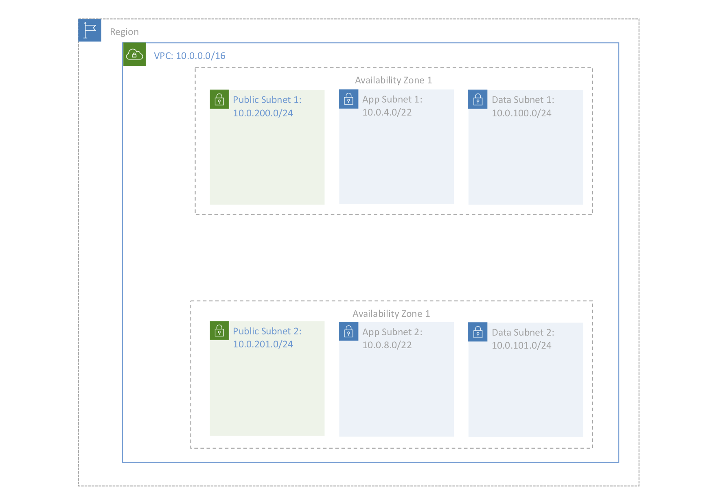

# **Launching A Flurdy Email Server on AWS with CloudFormation**

### Version 0.99.1

---

This reference architecture provides a set of YAML templates for deploying
primary and backup [Flurdy email servers][flurdy] (as extended by [Jon
Jerome] for Dovecot support) on AWS using [AWS CloudFormation], The servers
run

* [Amazon Linux 2]
* [Postfix]
* [Dovecot] IMAP
* [Amazon RDS MySQL]
* [Amavis] (amavisd-new with SpamAssassin Perl module)
* [ClamAV]
* SASL
* TLS
* Postgrey

with optional additional servers deployed for

* [Roundcube],
* [phpMyAdmin]

behind

* [Elastic Load Balancing]

The dedicated Flurdy fan will already notice several, minor variations
from the default Flurdy deployment (the use of Amazon Linux 2 instead
of Ubuntu (Flurdy) or Debian (Jon Jerome); moving MySQL off the server
and onto RDS; the upgrade to Amavis which no longer runs spamd; and the
migration of Roundcube and phpMyAdmin to standalone servers). These and
other variations are discussed in [Variances from
Flurdy](#variances-from-flurdy).

**NB**: These templates are beta. They work for me, but that's about
all I can say. Please try them, break them, and report any problems (or,
better, submit patches).

### Rationale

I've been using Ivar Abrahamsen's excellent Flurdy guide for setting up
my personal email servers for ... I don't know how long. At least 9
years, maybe longer. If this is the first time you're setting up an email
server (or at least, the first time in a long time), I _highly_ recommend
you go read his guide. However, even with his guide, email is a giant
PITA.

Web servers are easy. DNS is (relatively) easy. But every time I go to touch
something on an email server (never mind install a new one from scratch),
it takes _days_ for me to figure it out and get things working. Enter
CloudFormation. Now, with near-enough the click of a button, I can have
a fully-functional testing environment set up where I can poke around with
whatever changes I want to make, without disrupting my "production" servers.
Then I can do something like a blue-green swap, and _voilà_.

Plus, this was a good excuse to learn CloudFormation.

Plus, this was an opportunity to give back to the community. I've been
a user of open-source projects for decades, but I haven't really
contributed anything back since I moved to Europe in 2011. To wit, this
is my first project on GitHub, so if I'm doing something wrong, don't
hesitate to let me know. And hopefully others find these templates useful,
and hopefully you contribute back patches to make them better (see [To
Do](#to-do)).

_**Chris Richardson**_

## TL;DR — Launch the Stack
To launch the entire stack and deploy a Flurdy primary (and, optionally,
backup) email server on AWS, click on one of the **Launch Stack** links
below. When you're done, point your DNS entries for webmail.example.com
and phpmyadmin.example.com (replaced with your correct domain names) to
the load balancer.

*Caveat emptor*, you should not do this unless you're familiar both
with the Flurdy email server setup, and AWS CloudFormation.

*NB*: If you enable phpMyAdmin or Roundcube support, you *must* create a
certificate in [AWS Certificate Manager]. The certificate must include the
relevant DNS names.

| AWS Region Code | Name | Launch |
| --- | --- | --- 
| us-east-1 |US East (N. Virginia)| [] |
| us-east-2 |US East (Ohio)| [] |
| us-west-2 |US West (Oregon)| [] |
| eu-west-1 |EU (Ireland)| [] |
| eu-central-1 |EU (Frankfurt)| [] |
| ap-southeast-2 |AP (Sydney)| [] |

## Overview

The repository consists of a set of nested templates. The master
template nests four sub-templates: one for general infrastructure,
one for phpMyAdmin, one for web-specific infrastructure, and one
for email-specific infrastructure.  Each of these, in turn, nest a
series of templates which are run in order. Nested templates can
be run individually in order, entering the appropriate input
parameters for each stack. To just get things running as quickly
as possible, go ahead and run the master template. However, in
actual practice, I tend to run the first-level stacks (infrastructure,
phpMyAdmin, web, and email) separately.  Even (especially) when
making minor changes, I do this because the databases take a long
time to set up (it's only a few minutes, but if you have to take
them down and set them back up every time you make a change and get
a typo in YAML, it becomes annoying).

The infrastructure template sets up the [Amazon Virtual Private
Cloud], with three subnets — one public subnet (a DMZ in classic
networking parlance), one private subnet for applications, and one
private subnet for the data layer — in each of two availability
zones; two [Auto Scaling] groups (one for [NAT Instances], which
by default spin up one instance per AZ, and one for [Bastion Hosts],
which by default spin up none); and an Amazon RDS MySQL server
in the data subnet in one availability zone, with a read-replica
MySQL server in the second availability zone. Optionally, it creates
an [Application Load Balancer] (ALB), which splits traffic across
the Webmail servers (in my live deployments these same servers are
used for my WordPress hosting) and phpMyAdminServers. A single ALB
is used for both web and phpMyAdmin, and traffic routing is
accomplished with [host-based routing]. To do this, you must know
the DNS name you want to use for each service, which you will
manually assign to the ALB, later. If you run your own DNS somewhere
other than AWS, you can do this as a CNAME, or if you use Route53,
you can create an alias. *NB*: if you configure either Roundcube
or phpMyAdmin, you _must_ enable the ALB.

The email template sets up an [Amazon EC2] (Amazon Elastic Compute
Cloud) instance running a Flurdy server in one of the public subnets,
and optionally a Flurdy backup server in the other public subnet;
and [Elastic Block Store] volumes for spool and (optionally) log
for each of the primary and backup mail servers. The Flurdy server
runs Postfix, Dovecot, SpamAssassin, ClamAV, and PostGrey. The
system uses SASL Authentication, and TLS encryption. The certificates
can be automatically generated from LetsEncrypt.

The optional phpMyAdmin template configures an autoscaling group.
By default zero instances are enabled. Much like the Bastion
autoscaling group, when you need to perform database management
with phpMyAdmin, you go to the EC2 console and change the minimum
and desired number of instances to 1. See the notes on the
infrastructure template (above) for mandatory requirements if you're
going to enable this feature. Both phpMyAdmin and Roundcube rely on
[Amazon Certificate Manager] for SSLl

The optional web template configures an autoscaling group, which defaults to 
1 EC2 instance running [Apache] and Roundcube. See the notes on the
infrastructure template (above) for mandatory requirements if you're
going to enable this feature. Both phpMyAdmin and Roundcube rely on
[Amazon Certificate Manager] for SSLl

In addition to these general resources, if you have configured at least one
Amazon [Key Management Service] key, then you can configure either or both 
your RDS instances and EBS storage to be encrypted. Automatic backups can be
configured to push to S3 on a regular basis, and then from S3 to Glacier
after an extended period.

Finally, you have the option to populate the databases with Flurdy test
data, and to turn services on/off incrementally to aid in testing.

## Variances from Flurdy

### Significant Variances

#### Encrypted Passwords

Jon Jerome's Dovecot guide relies on the passwords being stored in
the databases in CRYPT. Instead we use SHA256. This would be a minor
change, except for the fact that it means you **can not migrate
databases directly from earlier Flurdy instances**. The method of
encrypting the password in the database has changed in a
non-backwards-compatible way. See the To Do list for more information.

### Minor Variances

#### Firewall

This does not install the Shorewall firewall. Instead, it relies on the 
VPC Public/Private architecture and AWS EC2 Security Groups to provide that
functionality, so the entire Firewall section of the Flurdy docs can be
ignored. As they say, "not essential for an EC2 image."

#### SASL

The entire SASL (Authentication) section of the Flurdy docs can be ignored,
as the current versions of Postfix and Dovecot support SASL via Dovecot.

#### Alternative Admin User shell

When setting up on EC2, the Flurdy docs describe the creation of a [Simple
Server] as the basis for all future servers.  Part of that description
includes uploading your private SSH keys, creating a new user, and adding
that user to certain groups. Finally, it optionally suggests removing the
default user used by AWS to launch the instances. While this is good
practice in general, it doesn't really work with CloudFormation, as you
need the AWS system to continue to be able to access the server. I do
provide the ability to add an additional admin user, and to add login
files for that user (.profile .shrc). However, because I'm old and grumpy,
I use ksh, not bash. That should probably be fine for most people, but if
you're approximately equally old and grumpy and want bash (or something else),
you're out of luck for the moment (though, adding the ability to support
other shells is on the To Do list).

#### Linux distribution

Flurdy uses Ubuntu. Jon Jerome uses Debian. These templates use Amazon
Linux 2 (probably for [no good reason]).

#### GID and UID

Flurdy sets the GID and UID for virtual to 5000 in both cases. The UID is
configurable in these templates, and defaults to 5000 (in general, I default
to the Flurdy defaults ... that's kind of the point). However, there's no
good way to set the GID with CloudFormation, so it gets set automatically.

#### Dovecot SSL

Jon Jerome sets it to "yes". I set it to "required". (It's optional for
server-server SNMP communication, but why let it be optional for IMAP?)

#### Dovecot user query

Jon Jerome uses prefetch to get all of the information in one go. Mostly
this just works, but in the event you have Roundcube enabled, and a user
in the database, but that user has not yet received any mail, Dovecot gets
confused about the directory structure. To fix this (and prevent errors in
Roundcube) we modify the password_query to prefix "maildir:" to the
maildir path.

#### SSL Certificates

##### SSL for Email: Let's Encrypt

These templates default to getting "fake" SSL certificates for the email
servers from [Let's Encrypt], using [acme.sh]. This is approximately equivalent
to creating your own CA. The benefit is, once everything is working, you
can switch the configuration option, and get real SSL certificates that
will be accepted by people's IMAP clients. The downside is, it only works
if the primary domain for the mail server has DNS hosted in [Route53]. There
is an option to not install SSL certificates, and another to let you
put existing certificates in an S3 bucket and install them from there, but
neither of those options are tested (and probably don't work).

SSL certificates are in /etc/pki/dovecot and there are only two in the default
letsencrypt style, but the names are slightly different than Dovecot
instructions specify.

.chain.pem includes the cert, intermediate certs, and CA cert. We no longer
use a separate setting for the CAcert.

##### SSL for Web

The SSL certificate for HTTPS are put on an Amazon Application Load
Balancer (ALB). This certificate come from [AWS Certificate Manager], 
and must be manually generated. Changing this to allow manual creation is
on the To Do list, but for now, the process is manual. The reason is, if you generate new ones via a CloudFormation stack, template execution
will pause in the middle, while you validate the new certificates (which
can be done either by email or DNS).
Further, if you're using [CloudFront], you **must** generate or import the
certificate in the US East (N. Virginia) Region (us-east-1). The first problem
is minor, but the second one is significant. If and when ClouFormation
supports creation of certificates in other regions, I'll likely update the
templates to support certificate creation. In the meantime, you must manually
create a single certificate in your region of choice which covers all of the
relevant hosts which will be proxied by the ALB (probably something like 
www.example.com, phpmyadmin.example.com, and webmail.example.com).

#### Session Cache

Flurdy has the session cache file locations commented out, but sets the
cache timeout variable. I’m not sure what the intent here is, but according
to current postfix documentation, the default values for those commented
out file locations is “blank”. So, we set them. Also, as we’re using
postfix > 2.3, we set the lmtp cache database location.

#### Amavis and SpamAssassin

The amavisd-new config files are not broken out under a conf.d directory
in the version that Amazon Linux 2 installs. Instead, they’re all in one
file /etc/amavisd/amavisd.conf. Additionally amavisd-new installs
SpamAssasin on its own, including setting up /etc/cron.d/sa-update.
Additionally additionally, amavisd-new now calls the SpamAssassin perl
library directly, so spams is no longer launched.

#### ClamAV

For ClamAV, the only package installed in clamd, which pulls in the other
requirements. We grab the virus databases directly, to speed up launch,
but there’s still a problem with current ClamAV, that it takes longer
than systemctl allows for a service to start, and so we have to add a
delay.

#### Postgrey

Connect postfix and postgrey via unix socket instead of TCP.

#### Roundcube

I install Roundcube from the github source rather than the distribution
because the distributed version is ancient.

#### Extend - SPF Verification

The package system for Amazon Linux uses slightly different packages. I
install python3, and then use pip to install pypolicyd-spf, pyspf, and py3dns.
The configuration is in /etc/python-policyd-spf.

#### Extend - DKIM

I'm not actually sure this matters, but the configuration syntax for the
version of OpenDKIM that gets installed by yum appears to have slightly
different syntax. Instead of

SOCKET="local:/var/spool/postfix/var/run/opendkim/opendkim.sock"

it is

Socket local:/var/spool/postfix/var/run/opendkim/opendkim.sock

## Parameters

Almost all configuration that is described in the Flurdy documentation
defaults to that setting, and you should read the docs. However,
there are several configuration parameters which need to be set to
use these templates which are not covered by Ivar or Jon. Those
parameters are discussed here.

### General Parameters

#### Alternative superuser account to create

The Linux username for your alternative to the default ec2-user that is 
created. This user will be created on all instances, whether the standalone
mail servers, or the auto-scaling groups.

#### SSH public key for the AdminUser

The SSH public key for the above user. It's the **public** key, so there's
no danger in sharing it widely.

#### Existing Key Pair

This is the EC2 key pair that you want to use to set up the machines
(i.e., the key pair for ec2-user). You may not want to use this key
yourself, but you'll need to keep it installed so the stack can
still be managed (there's probably some way to allow you to upload
your own private key to manage the stack, but that seems ... silly.
If Amazon has your key, why not just use their key?).

#### AMI ID for Servers

Ivar recommends creating an AMI for all your future server uses. I
used to do that, but maintaining your own images is hard, and they
don't stay current. This is part of the reason I selected Amazon
Linux 2 — I'm pretty sure Amazon's engineers are better than me at
keeping the OS up to date and stable. They may not be as good as
the broader Linux community that you get with Ubuntu or Debian,
but, then again, we're not doing anything fancy in userland, except
for AWS specific stuff, so that's what we most care about being
current. Ergo, I use Amazon Linux 2. This field is a URL to an
[Amazon SSM parameter store] for the AMI you want to use. If you
go look at other CloudFormation templates, they will often use a
mapping to get a per-region AMI. When I initially wrote this, I
used that same paradigm, but put in my own AMIs. I changed to this
method because it seems cleaner. However, this URL resolves to a
value of type `'AWS::SSM::Parameter::Value<AWS::EC2::Image::Id>'`.
If you're using one of the sub-templates diredtly, you can use any
AMI ID that way. However, at the top level, it must be a URL, which
is interpreted as a string and passed to the subtemplates. So, if
you want to use a custom AMI, you have to get an SSM Parameter Store
ID for it.

### Amazon VPC Parameters

#### Number of Availability Zones

Currently, this must be exactly two. I've left it as a configuration
parameter, because I'd like to make it adjustable in the future (to support
3 or more), but that's too annoying for right now, and two should be
sufficient for most use cases. I also wanted to let it be one, because, in
particular, for testing it seems superfulous to spin up extra resources.
Unfortunately, I also wanted to pull MySQL off of the Flurdy server and
into RDS ... and RDS requires at least two availability zones. Ergo, we
must have two.

#### VPC Subnets

You can configure these however you want within the rules of [AWS VPC
subnetting] (between a /16 and a /28). If you don't know what CIDR stands
for, just leave them alone. They're fine. Here's what they look like by
default:

### AWS Security Group Parameters

#### SSH Access From

Internally to the VPC, the instances only accept SSH connections from the
Bastion instances, which are part of an autoscaling group with zero
members. If you want to access any instances direclty, you need to launch
a Bastion instance. Once that instance is launched, this is the address
range from which it will accept connections. If you're an individual or
small comnpany behind a NAT, you should probably set this to
<my.ip.v4.addr>/32. If you have routable addresses assigned to your
corporation, you can be broader. If you are often moving about or otherwise
don't have fixed addresses, you can leave the default (accessible from
anywhere), and rely on the (lack of) existence of Bastion hosts to
minimize outside attacks.

##### Using Bastion to access EC2 instances

From the EC2 console, navigate to Auto Scaling groups and find the Bastion
launch configuration for your stack. Edit the launch configuration and
set the desired instances to 1. Press Save and the Bastion instance will
be created. Bastion is a gateway to your instances for enhanced security.

SSH into the public IP address of the Bastion with `ssh -A` if you've
already done `ssh-add`. From there, you can ssh to the private IP address
of any of your instances (you get the public and private IP addresses of
instances from the AWS EC2 console).

#### Create a Security Group for Mail Servers

This should probably always be "True". The only reason I can think
of to set it to false is if you want to use the infrastructure
templates for something other than mail.

### Amazon MySQL RDS Parameters

Most of these are self explanatory. However, a few deserve comment.

#### DB Instance Class

For almost everything, I use the smallest instance available. For
home users, and even small businesses, nano sized servers are
sufficient (e.g., you can run multiple WordPress sites from a nano
instance). However, in the case of RDS, you can't go that small.
The smallest (cheapest) you can actually select is db.t2.micro.
However, that instance size doesn't support encryption at rest.
So, if you're going to encrypt your databases at rest, you need to
select at least db.t2.medium. That makes this far-and-away the most
expensive part of the solution, but it's still not too bad.

#### AWS KMS Customer Master Key (CMK) to encrypt DB

This is the ARN of a CMK that you've previously created in AWS. You can use
the same key for this and for encrypting your EBS volumes at rest, or
different ones. (See [AWS KMS Best Practices]).

##### Optional: Encrypting Amazon MySQL DB data at Rest

This reference architecture allows you to encrypt your databases
using keys you manage through AWS Key Management Service (KMS). On a
database instance running with Amazon encryption, data stored at
rest in the underlying storage is encrypted, as are the automated backups,
snapshots, and replicas. Encryption and decryption
are handled seamlessly so you don’t have to modify your application to
access your data. When you launch this AWS Cloudformation stack, you can
choose to enable database encryption via a parameter in the master
template.

#### Snapshot to restore from

If you're doing blue-green hot swaps, you can use this to move your 
database from one production stack to the other.

### Bastion and NAT Configuration

#### Instance Type

You probably just want to leave this as is. **Maybe** you can get enough
traffic to justify a larger NAT size, but you'd almost certainly have to be
too large of an organization to be using these templates in order to increase
your Bastion size. Nevertheless, your call. (See [this blog post][t2vt3] for a
discussion of t2 vs t3).

#### Alternative IAM Role, Initialization Script, and Environment Variables

Hey, why not role your own? That's what these are for. Until you're sure,
probably leave them alone.

#### Enable Banner and BastionBanner

See [AWS S3 Configuration](#aws-s3-configuration).

### AWS S3 Configuration

This is probably needlessly complex. It's not that complex. But it could
probably be simpler.

S3 URLs look like

`https://<asset-bucket>.s3-<region>.amazonaws.com/<key/prefix/to/stuff>/<stuff>`

I keep Bastion and NAT scripts in

`https://mirovoy-public.s3-eu-central-1.amazonaws.com/mirovoy-refarch/cf-helpers/latest/[bastion|nat]/[scripts|var]`

So, if you've checked out this repository, but modified the scripts, you
can put them in your own S3 bucket, and then replace "mirovoy-public" with
your bucket name, and "mirovoy-refarch/cf-helpers/latest/" with your
prefix. Then, underneath that, create

* bastion/scripts/bastion_bootstrap.sh
* bastion/var/banner_message.txt
* bastion/var/skel/profile
* bastion/var/skel/shrc
* nat/scripts/configure-pat.sh
* nat/scripts/nat_bootstrap.sh

and play 'till your heart's content.

XXX Mail Stuff Here

#### Optional: Encrypting Amazon EFS Data & Metadata at Rest

Amazon EFS integrates with AWS Key Management Service (KMS) to support encryting file system contents using AWS KMS Customer Master Keys (CMKs). In an encrypted file system, data and metadata are automatically encrypted before being written to the file system. Similarly, as data and metadata are read, they are automatically decrypted before being presented to the application. These processes are handled transparently by Amazon EFS, so you don’t have to modify WordPress to take advantage of encrypted file systems. Encryption at rest is enabled by default for file systems you create using this cloudformation template. This option is exposed as a configurable Cloudformation template parameter. 'true' creates an encrypted file system. 'false' creates an unencrypted file system. To use the AWS-managed CMK for Amazon EFS (key alias: aws/elasticfilesystem) leave the *"Existing AWS KMS CMK for EFS"* parameter empty. To use a specific customer-managed CMK (within this AWS account or another AWS account) enter the CMKs ARN in the "Existing AWS KMS CMK for EFS" parameter field.

#### Optional: Amazon Certificate Manager SSL/TLS Certificates

AWS Certificate Manager (ACM) is a service that lets you easily provision, manage, and deploy Secure Sockets Layer/Transport Layer Security (SSL/TLS) certificates for use with AWS services. SSL/TLS certificates provisioned through AWS Certificate Manager are free.

If you don't already have an SSL/TLS certificate for your domain name, it is recommended that you request one using ACM. For more information about requesting an SSL/TLS certificate using ACM, please read the [AWS Certificate Manager User Guide](http://docs.aws.amazon.com/acm/latest/userguide/acm-overview.html).

Use ACM to request a certificate or import a certificate into ACM. To use an ACM certificate with CloudFront (optional input parameter), you must request or import the certificate in the US East (N. Virginia) region. To use an ACM certificate with Amazon ELB - Application Load Balancer (optional input parameter), you must request or import the certificate in the region you create the CloudFormation stack. After you validate ownership of the domain names in your certificate, ACM provisions the certificate. Use the ACM certificate Amazon Resource Name (ARN) as the optional Cloudfront and/or Public ALB ACM certificate input parameters of the master template.

[Amavis]: https://www.ijs.si/software/amavisd/
[Amazon Certificate Manager]: http://docs.aws.amazon.com/acm/latest/userguide/acm-overview.html
[Amazon EC2]: http://docs.aws.amazon.com/AWSEC2/latest/UserGuide/concepts.html
[Amazon Linux 2]: https://aws.amazon.com/amazon-linux-2/
[Amazon RDS MySQL]:https://aws.amazon.com/rds/mysql/
[Amazon SSM parameter store]:https://aws.amazon.com/blogs/compute/query-for-the-latest-amazon-linux-ami-ids-using-aws-systems-manager-parameter-store/
[Amazon Virtual Private Cloud]:http://docs.aws.amazon.com/AmazonVPC/latest/UserGuide/VPC_Introduction.html
[Apache]:https://httpd.apache.org
[Auto Scaling]:http://docs.aws.amazon.com/autoscaling/latest/userguide/WhatIsAutoScaling.html
[AWS Certificate Manager]: https://aws.amazon.com/certificate-manager/
[AWS CloudFormation]: http://docs.aws.amazon.com/AWSCloudFormation/latest/UserGuide/Welcome.html
[AWS KMS Best Practices]:https://d0.awsstatic.com/whitepapers/aws-kms-best-practices.pdf
[AWS VPC subnetting]:https://docs.aws.amazon.com/vpc/latest/userguide/working-with-vpcs.html
[Bastion Hosts]:https://docs.aws.amazon.com/quickstart/latest/linux-bastion/architecture.html
[ClamAV]: https://www.clamav.net
[Elastic Block Store]: https://aws.amazon.com/ebs/
[Elastic Load Balancing]: https://aws.amazon.com/elasticloadbalancing/
[Dovecot]: https://www.dovecot.org
[flurdy]: http://flurdy.com/docs/postfix/
[acme.sh]:https://github.com/Neilpang/acme.sh
[Jon Jerome]: https://xec.net/dovecot-migration/
[Key Management Service]:https://aws.amazon.com/kms/
[launch-use1]: https://console.aws.amazon.com/cloudformation/home?region=us-east-1#/stacks/new?stackName=FlurdyEmail&templateURL=https://mirovoy-public.s3.eu-central-1.amazonaws.com/mirovoy-refarch/mail-and-web/latest/aws-mirovoy-ref-arch-mail-master.yaml
[launch-use2]: https://console.aws.amazon.com/cloudformation/home?region=us-east-2#/stacks/new?stackName=FlurdyEmail&templateURL=https://mirovoy-public.s3.eu-central-1.amazonaws.com/mirovoy-refarch/mail-and-web/latest/aws-mirovoy-ref-arch-mail-master.yaml
[launch-usw2]: https://console.aws.amazon.com/cloudformation/home?region=us-west-2#/stacks/new?stackName=FlurdyEmail&templateURL=https://mirovoy-public.s3.eu-central-1.amazonaws.com/mirovoy-refarch/mail-and-web/latest/aws-mirovoy-ref-arch-mail-master.yaml
[launch-euw1]: https://console.aws.amazon.com/cloudformation/home?region=eu-west-1#/stacks/new?stackName=FlurdyEmail&templateURL=https://mirovoy-public.s3.eu-central-1.amazonaws.com/mirovoy-refarch/mail-and-web/latest/aws-mirovoy-ref-arch-mail-master.yaml
[launch-euc1]: https://console.aws.amazon.com/cloudformation/home?region=eu-central-1#/stacks/new?stackName=FlurdyEmail&templateURL=https://mirovoy-public.s3.eu-central-1.amazonaws.com/mirovoy-refarch/mail-and-web/latest/aws-mirovoy-ref-arch-mail-master.yaml
[launch-apse2]: https://console.aws.amazon.com/cloudformation/home?region=ap-southeast-2#/stacks/new?stackName=FlurdyEmail&templateURL=https://mirovoy-public.s3.eu-central-1.amazonaws.com/mirovoy-refarch/mail-and-web/latest/aws-mirovoy-ref-arch-mail-master.yaml
[Let's Encrypt]:https://letsencrypt.org
[NAT Instance]:https://docs.aws.amazon.com/vpc/latest/userguide/VPC_NAT_Instance.html
[Network Load Balancer]:https://docs.aws.amazon.com/elasticloadbalancing/latest/application/introduction.html
[no good reason]:https://www.juliandunn.net/2018/01/05/whats-amazon-linux-might-use/
[phpMyAdmin]:https://www.phpmyadmin.net
[Postfix]: http://www.postfix.org
[Roundcube]:https://roundcube.net
[Route53]:https://aws.amazon.com/route53/
[Simple Server]:http://flurdy.com/docs/ec2/ubuntu/index.html
[t2vt3]:https://www.cloudsqueeze.ai/amazons-t3-who-should-use-it-when-how-and-the-why/index.html
[WordPress]:https://wordpress.org
